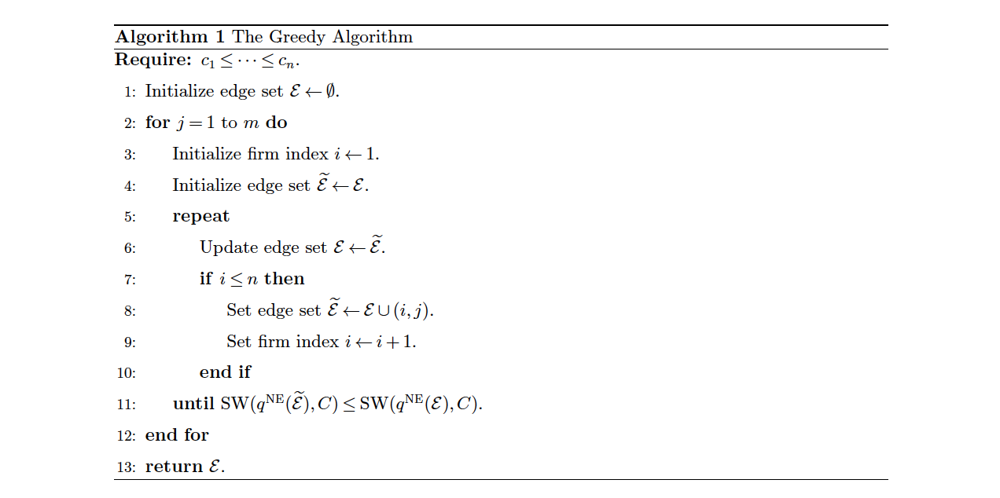
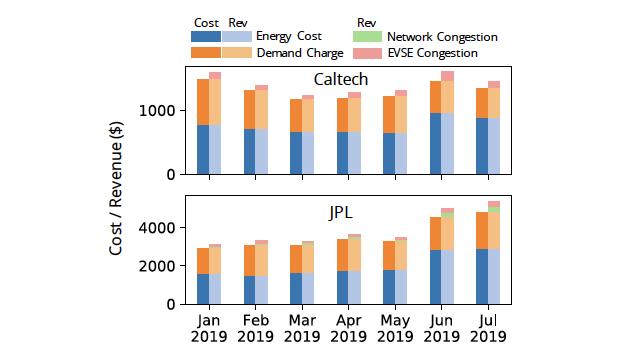
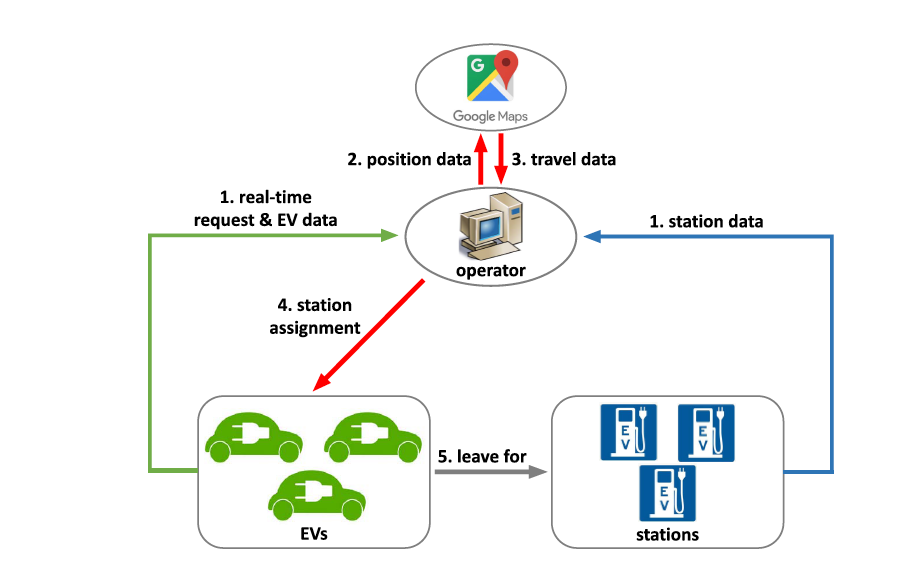
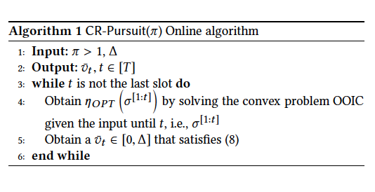

## About Me

I am currently a research scientist in the Energy Systems Group at [A\*STAR's Institute of High Performance Computing](https://www.a-star.edu.sg/ihpc), where I apply control, learning, and optimization algorithms to study smart grid operations. I recently co-lectured an undergraduate Game Theory course in the [Engineering Systems and Design Pillar at SUTD](https://esd.sutd.edu.sg/) over the summer with [Prof. Lingjie Duan](https://esd.sutd.edu.sg/people/faculty/lingjie-duan). Before starting at IHPC in 2020, I was a Data Scientist at [Schlumberger's Software Technology and Innovation Center at Menlo Park, CA, USA](https://www.slb.com/). 

I received my Ph.D. from [Caltech's Computing and Mathematical Sciences Program](https://www.cms.caltech.edu/) in 2019, where I was supervised by [Prof. Adam Wierman](https://adamwierman.com/) and [Prof. Steven Low](http://netlab.caltech.edu/). At Caltech, I received the [Amori Doctoral Prize in CMS](https://www.cms.caltech.edu/academics/honors) for my dissertation on Online Platforms in Networked Markets. I obtained my Bachelor's Degree in Mathematical Sciences (Pure Mathematics Track) from the [Nanyang Technological University's School of Physical and Mathematical Sciences](https://www.ntu.edu.sg/spms) in 2013. My Ph.D. and B.Sc. studies were funded by [Singapore's National Science Scholarship](https://www.a-star.edu.sg/Scholarships/for-graduate-studies/national-science-scholarship-phd) and the A\*STAR Undergraduate Scholarship.  

My research lies at the intersection of **optimization**, **control**, and **operations research** -- with a special focus on formulating and designing algorithms that are provably "not too bad" in both the offline and online optimization settings. My research is applied in the area of **power and energy systems**, **networking**, **economics**, and **computer science**.

Outside work, I enjoy spending time with my wife and daughter, playing badminton, and watching chess and soccer. 

<strong style="color:#e74d3c; font-weight:600"> At IHPC, we are looking for researchers (both B.Sc./M.Sc. and Ph.D. graduates) who are interested in applying computing and data science in the area of energy systems. Do drop me an email if you are interested. Strong Ph.D. candidates that are interested may also write to me to arrange for a summer or half-year internship. </strong>

## Recent News

- **[Oct. 2022]**  I will be visiting a number of research labs and startups in the U.S., including NREL, Colorado State University, LBNL, UC Berkeley, Stanford, [PowerFlex](https://www.powerflex.com/), Caltech, and [MOEV Inc](https://www.moevinc.com/). 
- **[Sep. 2022]**  I received a teaching score of 4.8/5.0 for 40.316. Big thanks to my students for their attention through evening classes in their final year. 
- **[May. 2022]**  I will be co-lecturing [40.316 Game Theory](https://esd.sutd.edu.sg/courses/40316-game-theory/) at [Singapore University of Technology and Design](https://www.sutd.edu.sg/). 
- **[Apr. 2022]**  Our Singapore Integrated Transport & Energy Model (SITEM) project won the [Ministry for Trade and Industry Firefly Borderless Silver Award](https://www.tum-create.edu.sg/news/tumcreate-researchers-recognised-contributions-singapores-2040-vision-all-vehicles-run-cleaner).
- **[Mar. 2022]**  I am helping to organize and will emcee the launch event for A\*STAR's Software and System Engineering Communities of Practice (CoP). 
- **[Feb. 2022]**  I am giving a [talk](https://esd.sutd.edu.sg/news-events/research-seminar-series/john-pang-astar-platforms-in-networked-cournot-competition-access-or-allocation-control/) on "Platforms in Networked Cournot Competition: Access or Allocation Control" at SUTD ESD Research Seminar Series. 
- **[Jan. 2022]**  Our paper titled ["Transparency and Control in Platforms for Networked Markets"](https://pubsonline.informs.org/doi/abs/10.1287/opre.2021.2244) got accepted into [Operations Research](https://pubsonline.informs.org/journal/opre).
- **[Jan. 2022]**  I will be moderating a session by [Prof. C&#233;dric Villani](https://www.cedricvillani.org/) at the [Global Young Scientist Summit 2022](https://www.nrf.gov.sg/gyss/home). 
- **[Dec. 2021]**  I am helping to organize and will emcee the Maritime AI Workshop, co-organized by IHPC and Singapore Maritime Institute (SMI). 

## Teaching/Mentoring

- Capstone Co-supervisor for Jonathan Chia, Yale-NUS College (Supervised with [Asst Prof Michael Choi](https://www.yale-nus.edu.sg/faculty/michael-choi/))
- Lecturer, [40.316 Game Theory](https://esd.sutd.edu.sg/courses/40316-game-theory/) at [Singapore University of Technology and Design](https://www.sutd.edu.sg/), 2022

<h2 id="publications" style="margin: 2px 0px -15px;">Selected Publications <temp style="font-size:15px;">[</temp><a href="https://scholar.google.com/citations?user=mQZqPVAAAAAJ&hl=en&oi=ao" target="_blank" style="font-size:15px;">Google Scholar</a><temp style="font-size:15px;">]</temp><temp style="font-size:15px;"></temp></h2>

<ol class="bibliography">
<li>

  

    
            <abbr class="badge">OR</abbr>
  

  

      
<a href="https://pubsonline.informs.org/doi/abs/10.1287/opre.2021.2244">Transparency and Control in Platforms for Networked Markets</a>

      
<strong>John Zhen Fu Pang</strong>, Weixuan Lin, Hu Fu, Jack Kleeman, Eilyan Bitar, Adam Wierman

      
<em>Operations Research <strong>(OR)</strong>, Volume 70, Issue 3, 2022.</em>
      

    

      <a href="https://pubsonline.informs.org/doi/abs/10.1287/opre.2021.2244" class="btn btn-sm z-depth-0" role="button" target="_blank" style="font-size:12px;">PDF</a>
    

  

</li>

   

<li>

  

    
            <abbr class="badge">EPSR</abbr>
  

  

      
<a href="https://par.nsf.gov/servlets/purl/10202834">Pricing EV charging service with demand charge</a>

      
Zachary Lee, <strong>John Zhen Fu Pang</strong>, Steven Low

      
<em> Elsevier Electric Power Systems Research <strong>(EPSR)</strong>, 2020.</em>
      

    

      <a href="https://par.nsf.gov/servlets/purl/10202834" class="btn btn-sm z-depth-0" role="button" target="_blank" style="font-size:12px;">PDF</a>
    

  

</li>
  
  

   

<li>

  

    
            <abbr class="badge">T-ITS</abbr>
  

  

      
<a href="https://authors.library.caltech.edu/106994/1/09254167.pdf">Online station assignment for electric vehicle battery swapping</a>

      
Zachary Lee, <strong>John Zhen Fu Pang</strong>, Steven Low

      
<em> IEEE Transactions for Intelligent Transportation Systems <strong>(T-ITS)</strong>, 2020.</em>
      

    

      <a href="https://authors.library.caltech.edu/106994/1/09254167.pdf" class="btn btn-sm z-depth-0" role="button" target="_blank" style="font-size:12px;">PDF</a>
    

  

</li>
  
   

<li>

  

    
            <abbr class="badge">SIGMETRICS</abbr>
  

  

      
<a href="[https://authors.library.caltech.edu/106994/1/09254167.pdf](https://core.ac.uk/download/pdf/216301973.pdf)">Competitive online optimization under inventory constraints</a>

      
Qiulin Lin, Hanling Yi, <strong>John Zhen Fu Pang</strong>, Minghua Chen, Adam Wierman, Michael Honig, Yuanzhang Xiao 

      
<em> Proceedings of the ACM on Measurement and Analysis of Computing Systems <strong>(Sigmetrics)</strong>, 2019.</em>
      

    

      <a href="https://core.ac.uk/download/pdf/216301973.pdf" class="btn btn-sm z-depth-0" role="button" target="_blank" style="font-size:12px;">PDF</a>
    

  

</li>

